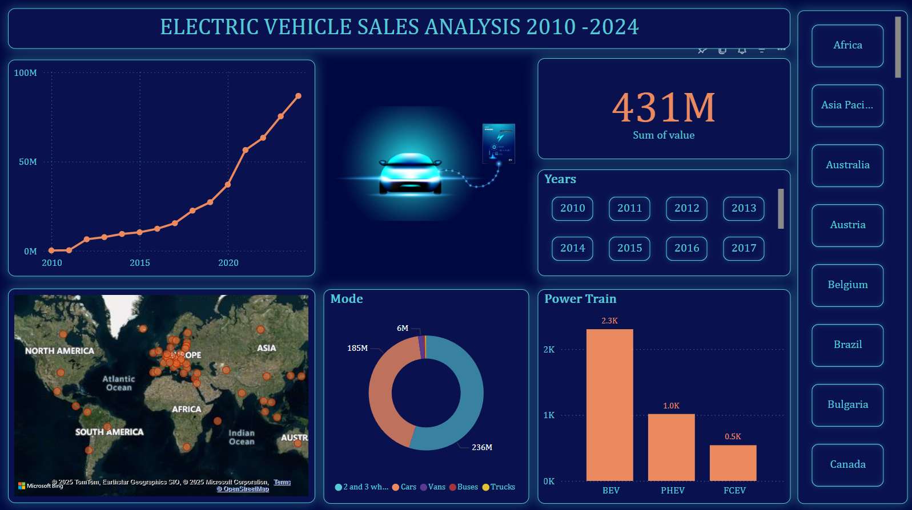

# Electric Vehicle Sales Dashboard (2010-2024)

This repository contains a Power BI dashboard analyzing global electric vehicle sales data from 2010 to 2024. The dashboard provides key insights into market trends, sales growth, regional performance, and powertrain adoption.

## Features

* **Sales Trends**: Visualize global EV sales growth with a line chart from 2010 to 2024.
* **Regional Insights**: Explore geographical sales distribution using an interactive map.
* **Vehicle Modes**: Analyze sales distribution across different vehicle types (e.g., cars, buses, trucks).
* **Powertrain Comparison**: Understand the adoption rates of BEV, PHEV, and FCEV technologies.
* **Summarized Metrics**: Display total sales values for quick reference.

## Data Source

The dashboard was created using electric vehicle sales data sourced from [International Energy Agency (IEA)](https://www.iea.org/) and other publicly available datasets.

## Dashboard Insights

1. **Rapid Growth**: EV sales have grown exponentially since 2015, driven by advancements in technology and policy support.
2. **Regional Leaders**: North America, Europe, and Asia dominate the EV market.
3. **Powertrain Trends**: BEVs are the most popular, followed by PHEVs and FCEVs.
4. **Vehicle Type Insights**: Cars lead the sales, followed by 2- and 3-wheelers.

## Future Scope

* Include forecasts for EV sales beyond 2024.
* Add more granular data, such as manufacturer-wise or state-wise insights.
* Automate data refresh with live connections.

 

